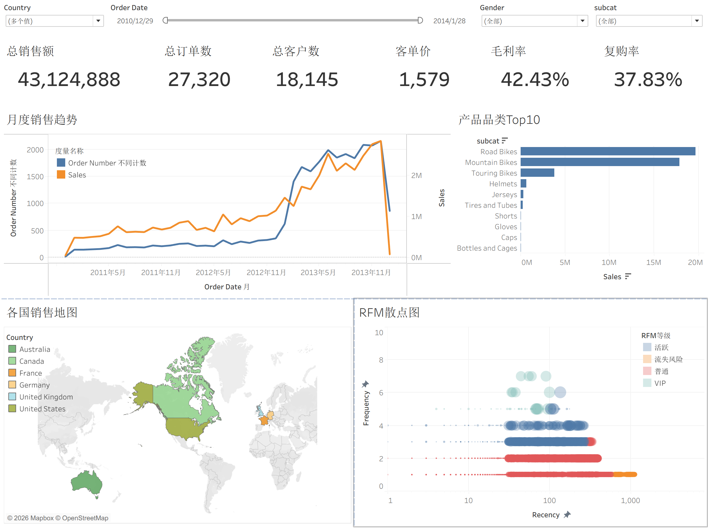

# SQL Data Warehouse Project

基于 **SQL Server** 构建的企业级数据仓库项目，通过整合 CRM 与 ERP 多源业务数据，完成从原始数据接入、数据清洗与整合，到面向业务分析的数据集构建。

项目采用 **ODS → DWD → ADS** 的经典数仓分层架构，并使用 **Tableau** 对 ADS 层数据进行可视化分析。

---

## 📌 项目简介

本项目模拟企业实际数据仓库建设场景，将来自不同业务系统的 CRM 与 ERP 数据统一接入 SQL Server 数据仓库。

通过分层设计，将数据处理过程拆分为：

* **ODS（Operational Data Store）**：原始数据接入与落地
* **DWD（Data Warehouse Detail）**：明细数据清洗、标准化及多源数据整合
* **ADS（Application Data Service）**：面向具体业务分析需求的数据集

最终通过 Tableau 对 ADS 层数据进行可视化，分析客户、产品及销售等业务主题。

---

## 📂 项目目录结构

```text
new_sql_warehouse_data/
│
├── datasets/
│   ├── source_crm/
│   │   ├── cust_info.csv
│   │   ├── prd_info.csv
│   │   └── sales_details.csv
│   │
│   └── source_erp/
│       ├── CUST_AZ12.csv
│       ├── LOC_A101.csv
│       └── PX_CAT_G1V2.csv
│
├── docs/
│   ├── 数据实体关系图(ER图).png
│   ├── 数据流向图.png
│   └── 星型模型ER图.png
│
├── scripts/
│   ├── ODS
│   │    ├── ddl_init_ods.sql
│   │    ├── ddl_alter_ods.sql
│   │    └── proc_load_ods.sql
│   │ 
│   ├── DWD/
│   │    ├── ddl_dwd.sql
│   │    ├── proc_load_dwd.sql
│   │
│   └── ADS/
│   │    ├── v_sale_flat.sql
│
├── tests/
│   ├── test_customers.sql
│   ├── test_products.sql
│   └── test_sales.sql
│
├── BI/
│   ├── 销售看板.png
│
└── README.md
```

---

## 🛠️ 技术栈

| Technology       | Purpose           |
| ---------------- | ----------------- |
| **SQL Server**   | 数据仓库建设与数据存储       |
| **T-SQL**        | 数据清洗、转换、关联及数据处理   |
| **Tableau**      | BI 可视化与 Dashboard |
| **Git / GitHub** | 项目版本管理与代码托管       |

---

## 🏗️ 项目架构

本项目采用 **ODS → DWD → ADS** 三层数据仓库架构。

```text
┌──────────────────────────────┐
│        Source Systems        │
│                              │
│   CRM                ERP     │
└──────────────┬───────────────┘
               │
               ▼
┌──────────────────────────────┐
│             ODS              │
│     原始数据接入与存储层       │
└──────────────┬───────────────┘
               │
               ▼
┌──────────────────────────────┐
│             DWD              │
│   数据清洗 / 标准化 / 数据整合 │
└──────────────┬───────────────┘
               │
               ▼
┌──────────────────────────────┐
│             ADS              │
│      面向业务分析的数据层      │
└──────────────┬───────────────┘
               │
               ▼
┌──────────────────────────────┐
│           Tableau             │
│        BI Visualization       │
└──────────────────────────────┘
```

---

# 📊 BI看板

项目使用 **Tableau** 对 ADS 层数据进行可视化分析。

Dashboard 主要围绕以下业务方向展开：



核心指标包括：

- 总销售额
- 总订单数
- 总客户数
- 客单价
- 毛利率
- 复购率

分析内容包括：

- 月度销售趋势
- 产品品类 Top10
- 各国销售地图
- RFM 散点图

---

# 📚 数据来源

本项目使用 [DataWithBaraa/sql-data-warehouse-project](https://github.com/DataWithBaraa/sql-data-warehouse-project) 项目提供的 **ERP 和 CRM 源数据**作为原始数据来源。

该数据集原本用于构建基于 SQL Server 的数据仓库项目，包含来自两个业务系统的 CSV 数据。本项目在此数据基础上，使用 **PostgreSQL + SQL + Python + Tableau** 重新设计数据处理流程，并按照 **ODS → DWD → ADS** 的分层方式进行数据仓库建设与 BI 分析。

---
